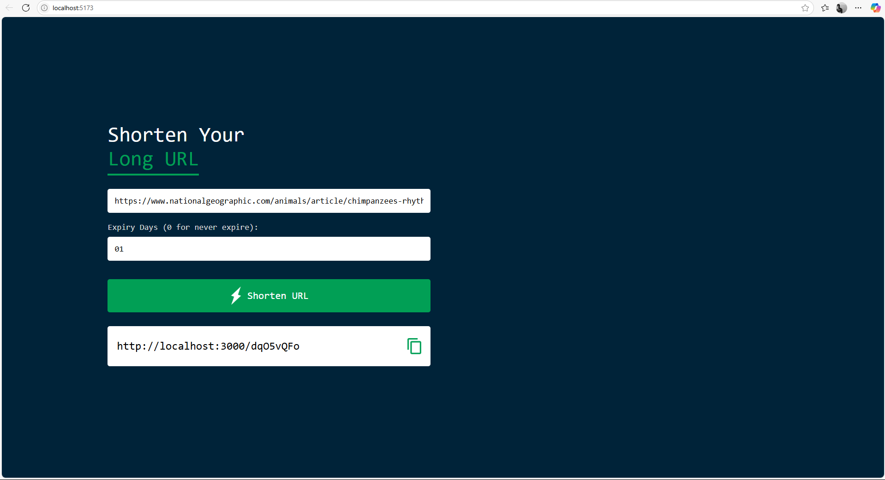
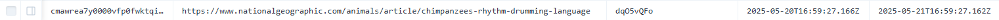

# URL Shortener Service

A full-stack URL shortening service with NestJS backend and React frontend.

Frontend:


Database:


## Features

- Shorten long URLs to compact, shareable links
- Customizable link expiration (days or never expire)
- Simple, clean user interface
- Copy shortened URL with one click
- Redirects to original URL when accessed

## Tech Stack

**Backend**

- NestJS
- Prisma ORM
- PostgreSQL
- Class-validator for DTO validation

**Frontend**

- React (TypeScript)
- Vite
- CSS

### Full Stack Project Using NestJS and React

```sql
PersuasivePost
```
